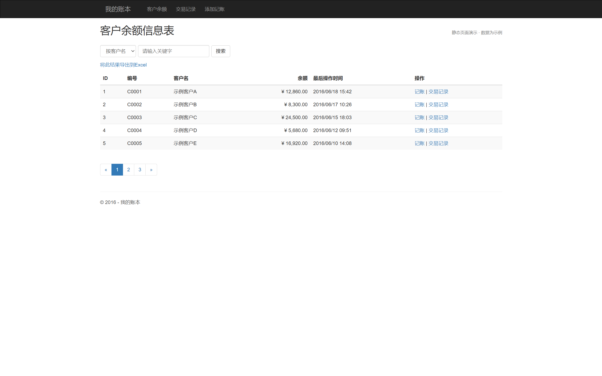
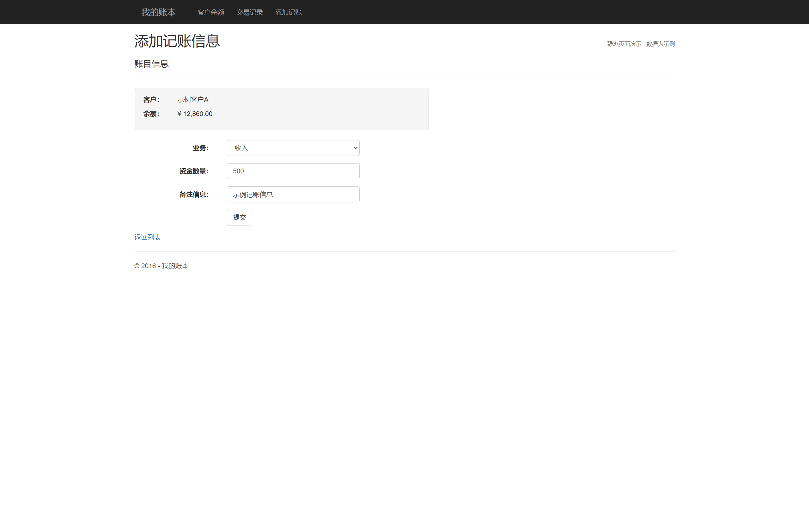
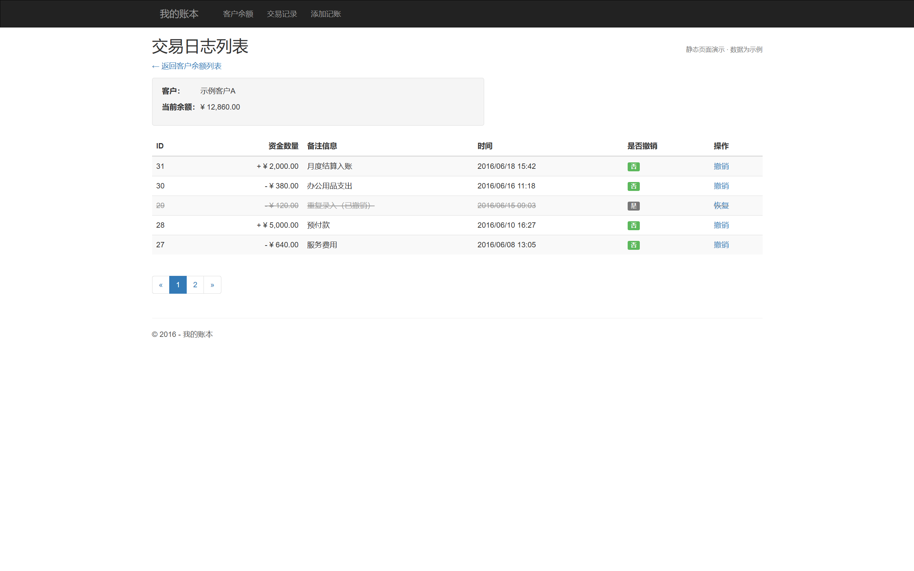

# MyAccount

[中文](README.md) | [日本語](README_ja.md)

基于 ASP.NET MVC 和 Entity Framework 开发的客户余额与收支记录系统。

## 项目介绍

大学期间一边学习 ASP.NET MVC，一边慢慢做出来的一个记账系统。

当时每天都和室友一起吃饭，我先统一结账，再记录每个人各自花了多少钱。室友们会隔一段时间把钱统一给我，于是我就想一边学习 MVC 架构，一边做一个账目管理的小系统。

项目从学期开始一点点增加功能，一直做到期末，最后作为一门课程的期末作业交给了老师。

至于实际记账这件事，早就被抛到九霄云外了。因为用 Excel 更方便。（￣▽￣）

这个项目的意义除了作为一份期末作业，也确实让我学到了不少关于 MVC 架构的知识。我也逐渐明白了一个道理：并不是所有东西都值得从头重新造一遍轮子。

在他人的成果上继续向前，很多时候可能是更有价值的做法。

<p align="center">
  
</p>

## 主要功能

### 客户管理

* 查看客户账户列表
* 根据条件搜索客户
* 客户信息的新增、修改和删除
* 客户列表分页
* 查看每位客户的当前余额
* 将查询结果导出为 Excel

### 记账管理

* 为指定客户添加收支记录
* 根据业务类型增加或减少客户余额
* 填写记账金额和备注
* 查看客户的历史交易记录
* 查询全部交易日志
* 撤销交易记录
* 恢复已经撤销的交易
* 撤销或恢复交易时同步修正客户余额

<p align="center">
  
</p>

<p align="center">
  
</p>

### 管理员与权限

* 管理员登录
* 管理员账号管理
* 管理员等级区分
* 根据权限限制页面访问
* 使用 Session 保存登录状态

### 业务类型管理

* 创建收入、支出等业务类型
* 设置不同业务类型对余额的影响方式
* 在记账时选择相应的业务类型

## 系统结构

项目采用 ASP.NET MVC 的基本结构，并在 Controller 与数据访问之间增加了 Service 层。

```text
浏览器
  │
  ▼
Razor View
  │
  ▼
Controller
  │
  ▼
Service 业务逻辑
  │
  ▼
Entity Framework
  │
  ▼
SQL Server LocalDB
```

各部分的主要职责如下：

* **View**
  使用 Razor 模板显示客户、交易记录、管理员和记账页面。

* **Controller**
  接收浏览器请求，处理页面跳转，并调用相应的业务逻辑。

* **Service**
  负责客户管理、记账、余额变更、交易撤销和管理员认证等业务。

* **Model**
  定义客户、管理员、业务类型和交易记录等数据结构。

* **Entity Framework**
  负责对象与数据库之间的映射和数据持久化。

* **SQL Server LocalDB**
  保存客户信息、管理员信息、业务类型和交易记录。

## 架构上的尝试

### MVC职责划分

页面显示、请求处理和数据模型分别放在 View、Controller 和 Model 中，避免把所有代码集中在页面里。

### Service层

项目为主要业务功能定义了 Service 接口和实现类，将记账和客户管理等逻辑从 Controller 中分离出来。

虽然当时还没有真正引入依赖注入容器，但已经开始尝试减少 Controller 直接承担业务逻辑的情况。

### 自定义权限检查

项目通过自定义 `AuthorizeAttribute` 检查管理员的登录状态和权限等级，限制未登录用户或权限不足的管理员访问特定页面。

### 余额与交易记录的一致性

添加收支记录时，系统会同时更新客户余额。

撤销一条交易时，不仅会修改交易记录的状态，还会根据原来的金额反向修正客户余额；恢复交易时则再次恢复原有影响。

这一部分不仅是普通的增删改查，也需要考虑交易状态与余额之间的一致性。

### Code First数据库

项目使用 Entity Framework Code First，根据 C# 中的数据模型生成数据库结构，并在首次初始化时创建默认管理员数据。

### 分页与Excel导出

客户和交易记录列表支持分页，客户查询结果还可以导出为 Excel 文件。

## 主要数据模型

### Customer

客户信息主要包括：

* ID
* 客户编号
* 客户名称
* 登录密码
* 当前余额
* 最后操作时间

### Owner

管理员信息主要包括：

* ID
* 登录名
* 密码
* 管理员等级
* 账号状态

### Account Type

业务类型主要包括：

* ID
* 业务名称
* 对余额的影响方式
* 业务说明

例如：

* 收入
* 支出
* 余额调整

### Account Log

交易记录主要包括：

* ID
* 客户信息
* 业务类型
* 金额
* 备注
* 操作时间
* 是否撤销

## 记账流程

```text
选择客户
   │
   ▼
选择业务类型
   │
   ▼
填写金额和备注
   │
   ▼
生成交易记录
   │
   ▼
修改客户余额
   │
   ▼
保存到数据库
```

撤销交易时：

```text
选择交易记录
   │
   ▼
判断当前状态
   │
   ▼
反向计算原交易影响
   │
   ▼
修正客户余额
   │
   ▼
标记交易为已撤销
```

## 使用技术

| 分类          | 技术                     |
| ----------- | ---------------------- |
| 开发语言        | C#                     |
| Web框架       | ASP.NET MVC 5.2.3      |
| 运行环境        | .NET Framework 4.6     |
| ORM         | Entity Framework 6.1.3 |
| 页面模板        | Razor                  |
| 数据库         | SQL Server LocalDB     |
| 前端框架        | Bootstrap 3            |
| JavaScript库 | jQuery                 |
| 开发工具        | Visual Studio 2015     |
| 本地服务器       | IIS Express            |
| 数据库开发方式     | Code First             |

## 项目目录

```text
MyAccount
├── Screenshots
│   ├── customer-balance-list.png
│   ├── add-account-entry.png
│   └── transaction-log-list.png
│
├── App_Start
├── Content
├── Controllers
├── fonts
├── Models
├── Properties
├── Scripts
├── Services
├── Utils
├── Views
│   ├── Account
│   ├── Customers
│   ├── Owners
│   ├── Shared
│   └── ...
├── Global.asax
├── Global.asax.cs
├── MyAccount.csproj
├── packages.config
├── Web.config
├── Web.Debug.config
└── Web.Release.config
```

## 补充说明

本仓库保存的是大学时期学习 ASP.NET MVC 时开发的课程项目，主要用于记录当时对 MVC 架构和业务系统开发的理解。

项目所使用的 .NET Framework、ASP.NET MVC、Bootstrap 和开发工具版本都已经比较早，也没有针对现在的开发环境重新适配，因此不保证可以直接在最新环境中运行。

代码中还保留着一些当时不成熟的实现，例如旧式密码处理、静态登录状态、部分异常处理不完整等问题，不适合直接作为现代生产系统使用。
